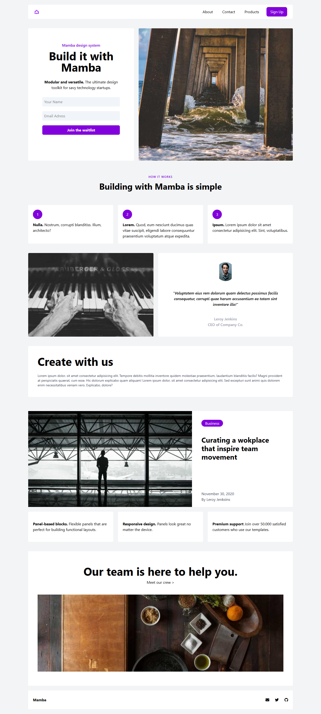

# :shopping_cart: TailwindCSS Landing Page Project | Mamba

[🇹🇷 Click for Turkish README](./README.tr.md)

*Created on: Feb 25, 2025*

* This project was created as **Week-4 / Assignment-1 / TailwindCSS LandingPage** for the Patika Frontend Bootcamp.
* Developed as a practice project for **CSS: Tailwind**.
* Built with **HTML**, **CSS**, and **TailwindCSS**.
* The template design provided by Patika was cloned using TailwindCSS.

---

## 🌐 Live Demo

> (You can add a live demo link here)

---

## :computer: Installation and Usage

1. Clone the project:
```bash
git clone https://github.com/tunahanyasar/landing-page-tailwind.git
```
2. Navigate to the project directory:
```bash
cd landing-page-tailwind
```
3. Open `index.html` in a web browser.

---

## 📜 Project Structure

:open_file_folder: **Folders;**
* `index.html` - Main page
* `tailwind.config.js` - TailwindCSS configuration
* `img/` - Project images (uses picsum.photos)
* `img-page/` - Screenshots for the README

### Main Components
- **Header:** Navigation bar with links to About, Contact, and Products
- **Main:** One-page layout with 6 sections (Hero, About, Works, Products, Team, etc.)
- **Footer:** Social media and contact icons

---

## :star2: Key Features

- Fully responsive one-page design
- Modern UI with TailwindCSS utility classes
- Flex and grid layouts
- Hover effects and interactive elements
- Google Material Symbols and FontAwesome integration
- Uses picsum.photos for images

---

## 💡 Technologies Used

**Frontend:**
* HTML5
* CSS3
* TailwindCSS
* FontAwesome
* Google Material Symbols

---

## 🎯 Project Goals

1. **User Experience**
   - Clean, modern, and responsive landing page
   - Easy navigation with in-page links
2. **Technical Achievements**
   - Effective use of Tailwind utility classes
   - Modern CSS techniques for layout and interactivity

---

## 📸 Screenshots

### Full Page


---

## 📞 Contact

[Tunahan Yaşar](https://github.com/tunahanyasar)

* GitHub: [@tunahanyasar](https://github.com/tunahanyasar)
* LinkedIn: [Tunahan Yaşar](https://www.linkedin.com/in/tunahan-yasar/)


