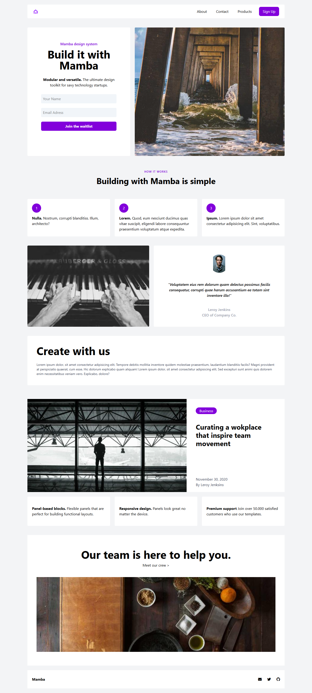

# :shopping_cart: TailwindCSS LandingPage Projesi | Mamba

[🇬🇧 İngilizce README için tıklayın](./README.md)

*Oluşturulma Tarihi: 25 Şubat 2025*

* Bu proje, Patika Frontend Bootcamp'i için oluşturulan **Hafta-4 / Ödev-1 / TailwindCSS LandingPage** projesidir.
* **CSS: Tailwind** alıştırması için bir pratik projesidir.
* **HTML**, **CSS** ve **TailwindCSS** kullanılarak geliştirilmiştir.
* Patika tarafından verilen LandingPage template tasarımı Tailwind kullanılarak klonlandı.

---

## 🌐 Canlı Demo

Canlı web sitesini ziyaret edin: [TailwindCSS Landing Page - Mamba](https://landing-page-tailwind-alpha.vercel.app/)

---

## :computer: Kurulum ve Kullanım

1. Projeyi klonlayın:
```bash
git clone https://github.com/tunahanyasar/landing-page-tailwind.git
```
2. Proje dizinine gidin:
```bash
cd landing-page-tailwind
```
3. `index.html` dosyasını bir web tarayıcısında açın.

---

## 📜 Sayfa Yapısı

:open_file_folder: **Klasörler;**
* `index.html` - Ana sayfa
* `tailwind.config.js` - TailwindCSS konfigürasyonu
* `img/` - Proje görselleri (picsum.photos kullanıldı)
* `img-page/` - README için ekran görüntüleri

### Ana Bileşenler
- **Header:** About, Contact ve Products linkleriyle navigasyon barı
- **Main:** 6 bölümden oluşan one-page yapı (Hero, About, Works, Products, Team, vb.)
- **Footer:** Sosyal medya ve iletişim ikonları

---

## :star2: Öne Çıkan Özellikler

- Tamamen responsive one-page tasarım
- TailwindCSS utility class'ları ile modern arayüz
- Flex ve grid düzenleri
- Hover efektleri ve interaktif öğeler
- Google Material Symbols ve FontAwesome entegrasyonu
- Görseller için picsum.photos kullanımı

---

## 💡 Kullanılan Teknolojiler

**Frontend:**
* HTML5
* CSS3
* TailwindCSS
* FontAwesome
* Google Material Symbols

---

## 🎯 Proje Hedefleri

1. **Kullanıcı Deneyimi**
   - Temiz, modern ve responsive bir landing page
   - Sayfa içi linklerle kolay gezinme
2. **Teknik Başarılar**
   - Tailwind utility class'larının etkin kullanımı
   - Modern CSS teknikleriyle düzen ve etkileşim

---

## 📸 Ekran Görüntüleri

### Tam Sayfa


---

## 📞 İletişim

[Tunahan Yaşar](https://github.com/tunahanyasar)

* GitHub: [@tunahanyasar](https://github.com/tunahanyasar)
* LinkedIn: [Tunahan Yaşar](https://www.linkedin.com/in/tunahan-yasar/) 